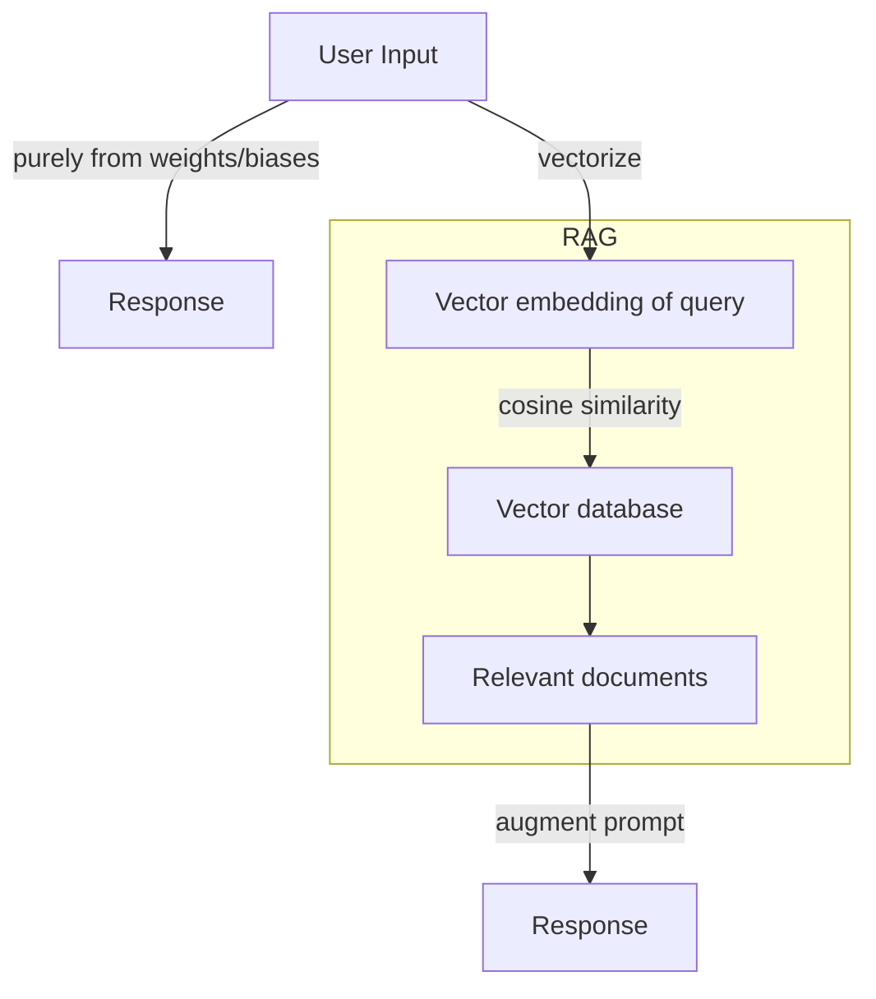
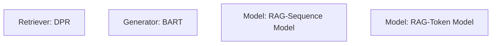

One of the things that's struck me about AI performance is that so much of it comes down to engineering problems - it's not a matter of *what* to do so much as *how* to do it. One such area is the need for long, extensive context in LLMs. This is the length of tokens that a language model recieves and performs inference on to generate a response. 

It seems plausible that more information here is better - the more information I give it, the more clearly it can recieve my instructions and accomplish my goal. However, the opposite is often true. Past a certain limit, additional context leads to dilution - attention, the mechanism by which the LLM processes and draws correlations between tokens, is finite. With more overall tokens, there is necessarily less emphasis on important tokens (notably, there is a "lost in the middle" phenomenon, where information encoded in middle tokens is lost compared to that at the beginning/end of the context window). This is a phenomenon known as context rot - as context length grows, the model experiences worse performance. Different architectures aim to combat this - RAG and RLMs are two such examples.

# RAG
RAG, or retrieval-augmented generation, is a way of offloading context to a database. Rather than pass all information as context, we do a search across this database, appending only what's useful to the query in question. This is often done through vector search - each item in the database is vectorized, and the query is also vectorized. Then, the most relevant k items (determined by cosine similarity, keyword search, semantic search, or another form of comparison) are appended to the query.

This is a method that balances grounding queries in a knowledge base with preventing context from getting too long. Its clear benefit is speed - we reduce the question of pulling information into a search problem, which can be accomplished much more quickly than tool calls or dynamic ways of extracting information. It also reduces hallucination, out-of-date answers, answers from untrustworthy sources, and inaccurate terminology and nuance - we set a constraint on the information on which the model bases its response. 

In general, this looks like:


However, one major problem with RAG is that it decouples two functions - thinking and search. The 'thinking' part is the model's reasoning over tokens, while the search is simply naively appending extra information. On simple retrieval questions, this is fine. However, when we want to dynamically influence what we're searching for, or 'think while we search', RAG is too constrained. Think of doing a reading comprehension test - a question does not map neatly from "what colour is the balloon" to "the balloon is red." If we pose a more complex question, say, "why did Jenny slip on the way to work?" where the context is "it rained yesterday, then the temperature descended to a frigid -3 degrees," we can see that a simple retrieval could miss the necessary context.

## Paper: [Retrieval-Augmented Generation for Knowledge-Intensive NLP Transformers](https://arxiv.org/abs/2005.11401)
Some notes while reading:
- The RAG architecture is defined as “models which combine pre-trained parametric and non-parametric memory for language generation” - in other words, we combine the training data baked into foundation models' weights (parametric), with additional relevant context from the database (non-parametric).
- This paper focused on a seq2seq model + dense vector index of Wikipedia, accessed with pre-trained neural retriever. 
- A base 'vanilla' model learns facts through generalization across data. However, this process of simple next-token prediction alone produces hallucinations and is too non-deterministic, thus need for a retriever.
- Architecture:
    - RAG-sequence model: use retrieved document to generate sequence - a single top document latent variable (ie. generate an entire output sequence conditioned on each document individually, then combine)
    - RAG-token model: draw different latent documents for each token (ie. at each output position, marginalize over all retrieved documents, combining the document context across different documents as we generate output)
    - DPR: bi-encoder architecture, perform maximum inner product search (cosine similarity) after documents and queries encoded by BERT
    - BART: encoder-decoder, seq2seq transformer model
- Basically: we can model this two ways, one in which a single document is used as context for the entire sequence and the other in which a different document is used per token. We have the retriever (performing the task of searching) and the generator (performing the task of ‘reasoning’ or creating output). This architecture is trained with stochastic gradient descent with a loss function, just as a 'vanilla' model is.
    - To decode for rag-token, we simply augment tokens with desired document. For rag-sequence, we use *beam search + fast decoding* (no details given here).



- Some interesting additional results: RAG is found to be more factual/specific than base models across the measured benchmark experiments. Interestingly, more documents ≠ better - performance caps at 10 retrieved documents.


# RLMs
RLMs promise to provide a way of avoiding overloading the context window, while still allowing reasoning over a large body of context. The context window stays bounded at K tokens per invocation, while the semantic horizon over the input is unbounded.

The notion of subagents and recursive subcalls is not a new premise - for instance, they're commonly used in Claude Code for specialized tasks. However, RLMs enable native recursion - typically, for an LLM to invoke another agent, it writes out a natural language prompt, sends that to another LLM instance, gets back a natural language response, and must read and interpret that response. This is known as a verbalized subcall. On the other hand, native recursion involves the model calling itself programatically on a slice of the prompt. This happens directly in the code execution environment, rather than through imprecise language calls. 

## Paper: [Recursive Language Models](https://arxiv.org/abs/2512.24601)

- RLMs are a “general inference paradigm that treats long prompts as part of an external environment and allows the LLM to programmatically examine, decompose, and recursively call itself over snippets of the prompt.” 
- We note that long context is especially relevant with long-range tasks with a need for extended context - a key research area right now is on “whether it is possible to scale the context size of general-purpose LLMs by order of magnitude.”
- Current most popular inference-time method for long context is compaction, but there is fundamentally something lost when we constrain material to fewer tokens.
- In this architecture, arbitrarily long prompts are not directly fed into NN, and are instead treated as part of environment - as a variable.

```markdown
here is prompt P, which you may interact with/slice/query but not print in its entirety.
encourage symbolic programs invoking LLM upon itself on slice of P
P := prompt
symbolic program := program manipulates own formulas/components - expressions to represent program text are also primary data structure
```

- Currently, language models are deployed 'in the wild' in various flavours of architectures - coding agents, retrieval agents, subagent delegation. However, all of these treat an external datasource as an environment for snippets. As a result, we fill up the context window and performance degrades.
- Note that ‘agent’ is a loose term, roughly a core AI model that has some goal and can perform a read/execute/tool call loop in service of that goal.
- Additionally, the current method of recursive subagent calls involves an LLM 'agent' invokes itself, but using verbalized subcalls (the parallel i would draw to this is building a web scraper when there exists a GET API endpoint, or selenium to click a button when there’s a programmatic endpoint to do so). RLMs instead use a native version of recursive calling.
- In this paper, RLM prompting encourages the model to figure out its own chunking: “you can iteratively chunk the context section by section, query an LLM, track relevant information in a buffer” or “combine [chunks] and recursively query an LLM over chunks”
- Architecture: base neural language model `M` with max context size `K` - we treat the user prompt as part of environment. The goal of this architecture is to have unbounded input tokens, unbounded output tokens, and an unbounded semantic horizon `(Omega(|P|)`
    - We initialize a persistent REPL, a variable with a prompt, and a function to invoke sub-RLM with a new prompt.
    - Each iteration of loop executes in REPL, updates state, collect stdout (constant-size metadata).
    
    ```markdown
    Algorithm 1: RLM around LLM `M`
    Input: prompt `P`
    Output: response `Y`
    state <- InitREPL(prompt=P)
    state <- addFunction(state, sub_RLM)
    hist <- [Metadata(state)]
    while True do
    	code <- LLM(hist)
    	(state, stdout) <- REPL(state, code)
    	hist <- hist || code || Metadata(stdout)
    	if state[Final] set then return state[Final]
    ```
    
    1. RLM gives underlying LLM a symbolic handle to prompt P (modify without copying into root)
    2. Do not generate output directly with ‘finish’ action, for that bounds output size
    3. RLM requires symbolic recursion, code inside `E` can invoke `M` on programmatically constructed transformations of P
- This represents a core paradigm shift: before, we can sparse query additional data but not user prompt itself. Now, we have a way of symbolic recursion now.

# Concluding Thoughts
As agents are used for longer-running tasks, the demand for longer context windows will only grow. There are many fascinating architectures through which to manage this - long context is increasingly an engineering problem more than a research one. Both RAG and RLMs offer interesting approaches - while RAG promises simplicity and speed, RLMs better preserve reasoning over input of arbitrary length. 