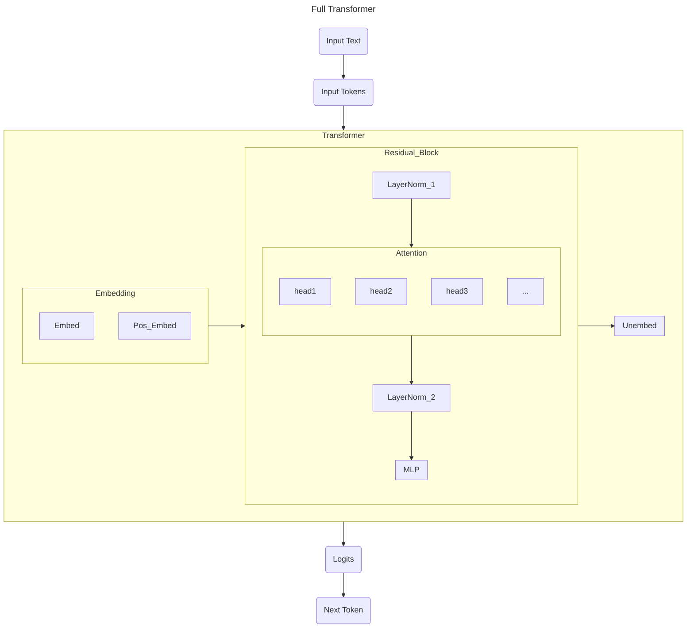

I've wanted to dive deeper into the fundamentals of AI for a while now - it feels a little bit magical, and a little bit wrong, to operate alongside AI without a strong understanding of how the underlying mechanisms work. Naturally, I had to write a transformer, and Neel Nanda's "[GPT-2 From Scratch](https://www.youtube.com/watch?v=dsjUDacBw8o&list=PL7m7hLIqA0hoIUPhC26ASCVs_VrqcDpAz&index=2)" was my resource of choice. My adaptation (source notebook [here](https://github.com/emma-x1/ml-from-scratch/blob/main/transformers.ipynb) - I have Andrej Karpathy's micrograd tutorial in the same repo) follows his implementation loosely, but is adapted to use fewer dependencies. I instead used only PyTorch and NumPy, loading the GPT-2 model from HuggingFace to compare and verify. 

This post is meant to document my process of learning and to address some of the questions I was curious about when implementing the transformer for the first time. It includes an overview of transformer basics and some of my intuitions, followed by some of the points of interest (transformer secrets, if you will) and challenges I ran into. 

# Transformer Basics
## How a Transformer Works
A transformer is an I/O machine - a "sequence modelling engine." We take in a string of text, tokenize it, and output the next most likely token. Repeated many times, this allows us to generate a body of text (or code, or images, or really any other sequence).

This transformer is really a series of linear algebra transformations in a high-dimensional vector space. With some simplifications made, this looks like the following diagram:


- Each block above within `Transformer` represents a layer - a matrix linear transformation.
- We implement `LayerNorm`, `Embed`, `PosEmbed`, `Attention`, `MLP`, and `Unembed` layers. `LayerNorm`, `Attention`, and `MLP` are joined into `Blocks`.
  - I go through each of these layers in a lot more depth in the notebook. There's also a lot of value in practicing by writing each one for yourself!
- Note the various heads of attention - essentially, each captures diffeerent dependencies in the sequence of tokens. For instance, one head of attention could capture how adjectives describe nouns, while another could 'focus' on how different objects within the sentence interact (real attention doesn't lend itself to such neat examples, but this made it easier for me to conceptualize). All of these heads of attention are operations that can be run in parallel, then all the outputs are re-joined and run through the MLP layer.
  - This is one of the crucial breakthroughs of the "[Attention is All You Need](https://arxiv.org/abs/1706.03762)" paper - before, we'd process each token sequentially in a way that couldn't be parallelized, meaning training was slow and we'd lose long-range dependencies. With attention, each token "looks" at every other token, all at once, solving both longer-range dependencies and parallelization.
- Key terms:
  - Residual stream: a vector of size `[batch, n_ctx, d_model]`. Within each `Block`, the `Attention` and `MLP` layers read *from* the residual stream, calculate some delta, and write *to* the residual stream, updating it for the next iteration. Essentially, we are updating it in place `x = x + attention(x)` and `x = x + mlp(x)`.
  - Context window: the maximum length of tokens that the model can input/output. There's been a lot of discussion about increasing context length for better performance - essentially stuffing more information into each call to the transformer. This is a key limiting factor for, say,long-running agents and video generation.

End to end, this looks like:
1. We take in a sequence of words as input: `<word> <word> <word> <word> <word>`
2. We tokenize them, mapping each word (or word segment) to a token in our dictionary `<token> <token> <token> <token>`
3. We embed the tokens - there's token embeddings (`Embed`) and positional embeddings (`PosEmbed`)
  - In `Embed`, we apply a matrix lookup table of shape `[d_vocab, d_model]` to tokens of shape `[batch, n_ctx]` to get a matrix of size `[batch, n_ctx, d_model]`.
    - *Intuition: We're converting tokens into a matrix. We process `batch` sequences in parallel. Each row of our token input matrix is one of those sequences, and each entry is a token. Each token is replaced by its corresponding value in the `Embed` matrix, which is a tensor of size `d_model` - it is essentially a dictionary mapping integer token values to tensors.*
  - We add `PosEmbed`, a lookup table of shape `[n_ctx, d_model]` to the same tokens of shape `[batch, n_ctx]`, getting another matrix of size `[batch, n_ctx, d_model]`.
    - *Intuition: We need to add positional information to our tensor: the sentence fragment "who I am" is different than "who am I." We basically do the same thing as in embed, but map the token positions rather than the values themselves. This means it's the same across each sequence in the batch (they're all made up of token1, token2, ...) so each row is identical.*
4. Next is the attention block, which consists of a `LayerNorm`, followed by `Attention`, then another `LayerNorm` and an `MLP` layer
  - In `LayerNorm`, we normalize the matrix, making sure values don't get too large or small. We have a vector of dimension `[d_model]` of ones (weights) and another of zeros (biases). These are tuned as the model trains. We normalize by substracting the average (making the mean 0) and scaling by variance (making the variance 1). Then, we multiply by the weight and add the bias to 'undo' normalization for specific dimensions.
    - *Intuition: we normalize the entire matrix to return to a baseline range of values, then allow the trained model to undo some of the normalization to emphasize certain dimensions as needed.*
  - Next is `Attention` (all you need!). There's actually many `heads` of atttention, each capturing different levels of dependencies between tokens. 
    - *Intuition: query and key tell us where dependencies between tokens occur. Value tells how much we care about that dependency. We mix these to give us the attention pattern, project that onto a matrix output, and add that to the residual stream.*
  - The last part of the attention block is `MLP`. This is the only place where we add nonlinearity to the model, and is the computation/memory step, processing the information in the sequence. It treats each token independently since positional info and dependencies have already been captured in the attention step. We project it up into a higher dimension (`d_mlp`), apply GELU, and then project it back down to the original size `d_model`.
    - *Intuition: projecting the model to a higher dimension allows it to 'think' or generalize.*
  - This is all packaged together in a `TransformerBlock`. We have this repeated `n_layers` times.
5. Finally, we have the unembedding step - `Unembed` turns the final residual stream matrix of size `[batch, position, d_model]` into a vector of logits. 
  - *Intuition: we have vectors in `d_model` space. We want to calculate the dot product between each vector and the words in our vocabulary, mapping each one to a 'closeness' to a token. Then, we take the softmax to turn that closeness score into a probability.*

We now have a loop to generate a single next token based on a string of tokens. Repeating that gives us text generation - the core of today's LLMs.

In the actual GPT-2 model (as well as in our implementation), we use the following parameters:
```
    d_model: int = 768 # dimensionality of the residual stream
    d_vocab: int = 50257 # size of our dictionary
    d_head: int = 64 # dimension per attention head (d_model / n_heads)
    d_mlp: int = 3072 # size of the MLP layer (4 * d_model)
    n_ctx: int = 1024 # maximum number of tokens in a sequence    
    n_heads: int = 12 # number of attention heads
    n_layers: int = 12 # number of transformer blocks
```

## Training vs. Inference
There's a key distinction between model *training* and model *inference* - during training, we're using the text that we're giving it to have it update its internal weights and biases to better predict the next token. During inference, we're no longer updating these weights, but rather using existing fixed weights to compute the next prediction on different input text.

To make training more efficient, then, we can get more training out of each piece of reference text if, instead of predicting only the last token after the entire body of text, we predict the next token for each prefix. This also allows us to tune the model's outputs towards real text - for example, if we had the text "Shall I compare thee to a summer's day?," we'd predict the next token after "Shall," the next token after "Shall I," after "Shall I compare," etc. We do this all simultaneously - the GPU can calculate the loss (and thereby update weights/biases) in one pass by applying a causal mask (hiding the tokens after the target prefix sequence), rather than looping through each prefix one at a time.

# Some Additional Exploration
## Hardware Considerations
The word 'compute' has been a topic of much discussion lately, and what that really centers around is a computer's ability to do calculations and run instructions - all handled by its CPU (central processing unit) and GPU (graphics processing unit).
A quick 101: 
I'm running the notebook on an Apple M3. 
mps cpu gpu

## Compares to Models Today

## Aside 1: Tokenizing
The process of tokenizing (converting raw input words to tokens) uses Byte-Pair Encoding (shoutout CS240E at Waterloo!), a process of encoding that uses a dynamic dictionary. We start with a dictionary having tokens for individual letters (ie. `a=1, b=2, c=3` - a bit of an oversimplication), and merging the most common groups of sequences to create a vocabulary of short strings (ie. the pair `a` + `b` occurs often, so we create in our dictionary `ab=4`), some of which are complete words and others are not. This forms our vocabulary of tokens, where each string corresponds to an integer.

I wonder if there's a different or more efficient way of tokenizing - maybe a more efficient algorithm or one that's independent of the English language? 

## Aside 2: Attention
this attention - self. others?
why output
- Why use `W_O` and `b_O` at all? I'd previously heard about the query-key matrices and the value matrix, but not the output. In the attention layer, we create an intermediate matrix `z` of shape `[batch, query_pos, n_heads, d_head]`. This is a mix of the attention scores (from `query` and `key`, indicating how much information each relationship holds), and values (from `value`, indicating ho)

to build this intuition - not only to understand the current architecture but to be able to come up with it from first principles, i guess it's:

when we cast from one shape to another, there's loss of information there. we want to learn the pattern for how we can do that most effectively over our text, rather than just blindly making it mathematically fit. 
heads don't interact

what does that mean, the heads landing in each dimension? 
```
Hint 2: Each head produces a d_head=64 dimensional output. Without W_O, head 0's output always lands in dimensions 0-63 of the residual stream, head 1 in 64-127, etc. What does W_O change about that?

Hint 3: Think about W_V and W_O together as a pair. Each head computes a rank-d_head update to the residual stream. What does that mean about what each head can express, and why might that be a useful property?

The mechanistic interpretability view is particularly clean here — Neel actually thinks about W_OV = W_V @ W_O as a single matrix per head. What shape is that, and what does it do?

low-rank factorized matrix for each head

A full linear map from 
d
m
o
d
e
l
→
d
m
o
d
e
l
d 
model
​
 →d 
model
​
 
 would be a 
768
×
768
768×768
 matrix (
589
,
824
589,824
 parameters).
By splitting into 12 heads of 64 dims, we do 
Q
⋅
K
T
Q⋅K 
T
 
.
This creates a 
1024
×
1024
1024×1024
 (context x context) attention matrix, but it's generated from much smaller vectors.
Each head is essentially looking for a single specific type of relationship (e.g., "find the previous noun", "find the start of the sentence").
```

## Transformer Secrets
A collection of miscellaneous rabbitholes I discovered - the more you know, the more you realize you don't know.
- [Initialization theory](https://stats.stackexchange.com/questions/637798/why-the-standard-deviation-of-the-bert-weight-initialization-is-0-02-by-default) - we have a mysterious parameter `init_range` set to 0.02 that normalizes our weights. In short, we need to keep our activations (values) within some healthy range to prevent either gradient explosion (if values are too big) or gradients vanishing (if values are too small). 0.02 is empirically tested but still a bit 'magical'.
- `einops` is a fascinating library - it makes the code declarative, not imperative so that we can describe by the results we want rather than how we want to do it. It's used to repeat certain values across the matrix - for instance, we can write `einops.repeat(pos_embed, "pos d_model -> batch pos d_model", batch=tokens.size(0))` to copy the positional embedding rows across the full matrix, rather than `pos_embed = pos_embed.unsqueeze(0).expand(tokens.size(0), -1, -1)`.
- `einsum` comes from "Einstein summation" 
- gelu - gpt2's new approximation, gelu/relu, projecting up/down to 'think'. tanh and 53.0%
```Differentiability: ReLU has a "hard" corner at zero. GELU is smooth everywhere, which makes the gradients "nicer" during backpropagation.
The "Dead ReLU" problem: In ReLU, if a neuron's input is negative, the gradient is 0—it "dies" and stops learning. GELU allows a tiny bit of information to leak through for negative values, which keeps the neuron "alive" even when it's not firing strongly.
```
- loss and evaluation

# The Process
My version of the GPT-2 notebook is here, and it goes through the math and code in a lot more depth. https://github.com/emma-x1/ml-from-scratch/blob/main/transformers.ipynb. Once again, it follows Neel Nanda's excellent GPT-2 From Scratch with minor adaptations to reduce dependencies. 

TODO talk about process
can outsource thinking but not understanding
develooping intuition - why is this layer here? why this operation? why adding instead of dot producting? efficiency and 
there's still some mystery
and the more you know the more you realize you don't know

Finicky while testing - WPE 
```
HuggingFace's wpe (Standard Approach): Uses a standard "Lookup Table" (nn.Embedding). This requires the developer to generate a second tensor of "position indices" [0, 1, 2...] and pass it into the model alongside the tokens.
Your PosEmbed (Optimized Approach): Since GPT-2 is almost always used with absolute positions starting from 0, your implementation infers the positions based on the shape of the input.
Pros: Cleaner API (one less input to the model).
Cons: Less flexible if you wanted to do "Position hacking" (like telling the model a word is at position 500 when it's actually at position 1).

api inconsistency ughhhh
understanding why he wrote the thing
```

# Conclusion
there's sooooo much FUN stuff here. BPE??? attention??? like we can just play.

context, memory, etc

building IN the model and building AROUND the model

interpretability, science, etc is so rich.

next - a visual guide + toy example