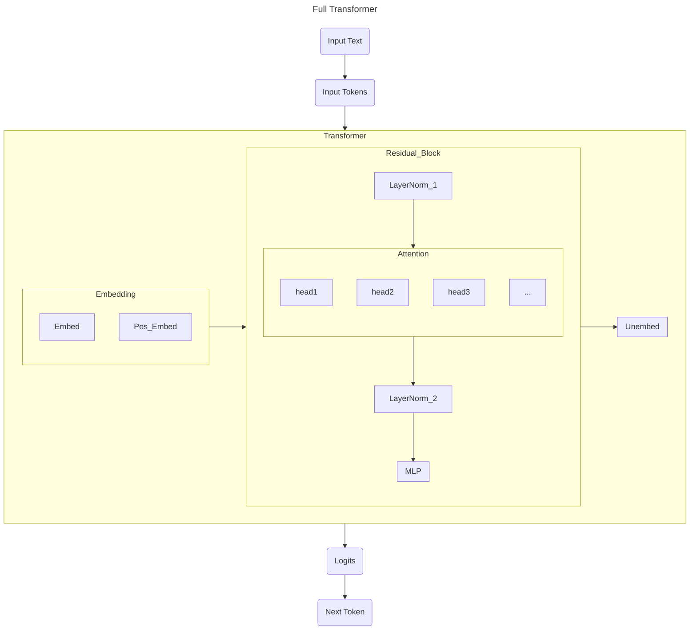

I've wanted to dive deeper into the fundamentals of AI for a while now - it feels a little bit magical, and a little bit wrong, to operate alongside AI without a strong understanding of how the underlying mechanisms work. Naturally, I had to write a transformer, and Neel Nanda's "[GPT-2 From Scratch](https://www.youtube.com/watch?v=dsjUDacBw8o&list=PL7m7hLIqA0hoIUPhC26ASCVs_VrqcDpAz&index=2)" was my resource of choice. My adaptation (source notebook [here](https://github.com/emma-x1/ml-from-scratch/blob/main/transformers.ipynb) - I have Andrej Karpathy's micrograd tutorial in the same repo) follows his implementation loosely, but is adapted to use fewer dependencies. I instead used only PyTorch and NumPy, loading the GPT-2 model from HuggingFace to compare and verify. 

This post is meant to document my process of learning and to address some of the questions I was curious about when implementing the transformer for the first time. It includes an overview of transformer basics and some of my intuitions, followed by some of the points of interest (transformer secrets, if you will) and challenges I ran into. 

# Transformer Basics
## How a Transformer Works
A transformer is an I/O machine - a "sequence modelling engine." We take in a string of text, tokenize it, and output the next most likely token. Repeated many times, this allows us to generate a body of text (or code, or images, or really any other sequence).

This transformer is really a series of linear algebra transformations in a high-dimensional vector space. With some simplifications made, this looks like the following diagram:


- Each block above within `Transformer` represents a layer - a matrix linear transformation.
- We implement `LayerNorm`, `Embed`, `PosEmbed`, `Attention`, `MLP`, and `Unembed` layers. `LayerNorm`, `Attention`, and `MLP` are joined into `Blocks`.
  - I go through each of these layers in a lot more depth in the notebook. There's also a lot of value in practicing by writing each one for yourself!
- Note the various heads of attention - essentially, each captures diffeerent dependencies in the sequence of tokens. For instance, one head of attention could capture how adjectives describe nouns, while another could 'focus' on how different objects within the sentence interact (real attention doesn't lend itself to such neat examples, but this made it easier for me to conceptualize). All of these heads of attention are operations that can be run in parallel, then all the outputs are re-joined and run through the MLP layer.
  - This is one of the crucial breakthroughs of the "[Attention is All You Need](https://arxiv.org/abs/1706.03762)" paper - before, we'd process each token sequentially in a way that couldn't be parallelized, meaning training was slow and we'd lose long-range dependencies. With attention, each token "looks" at every other token, all at once, solving both longer-range dependencies and parallelization.
- Key terms:
  - Residual stream: a vector of size `[batch, n_ctx, d_model]`. Within each `Block`, the `Attention` and `MLP` layers read *from* the residual stream, calculate some delta, and write *to* the residual stream, updating it for the next iteration. Essentially, we are updating it in place `x = x + attention(x)` and `x = x + mlp(x)`.
  - Context window: the maximum length of tokens that the model can input/output. There's been a lot of discussion about increasing context length for better performance - essentially stuffing more information into each call to the transformer. This is a key limiting factor for, say,long-running agents and video generation.

End to end, this looks like:
1. We take in a sequence of words as input: `<word> <word> <word> <word> <word>`
2. We tokenize them, mapping each word (or word segment) to a token in our dictionary `<token> <token> <token> <token>`
3. We embed the tokens - there's token embeddings (`Embed`) and positional embeddings (`PosEmbed`)
  - In `Embed`, we apply a matrix lookup table of shape `[d_vocab, d_model]` to tokens of shape `[batch, n_ctx]` to get a matrix of size `[batch, n_ctx, d_model]`.
    - *Intuition: We're converting tokens into a matrix. We process `batch` sequences in parallel. Each row of our token input matrix is one of those sequences, and each entry is a token. Each token is replaced by its corresponding value in the `Embed` matrix, which is a tensor of size `d_model` - it is essentially a dictionary mapping integer token values to tensors.*
  - We add `PosEmbed`, a lookup table of shape `[n_ctx, d_model]` to the same tokens of shape `[batch, n_ctx]`, getting another matrix of size `[batch, n_ctx, d_model]`.
    - *Intuition: We need to add positional information to our tensor: the sentence fragment "who I am" is different than "who am I." We basically do the same thing as in embed, but map the token positions rather than the values themselves. This means it's the same across each sequence in the batch (they're all made up of token1, token2, ...) so each row is identical.*
4. Next is the attention block, which consists of a `LayerNorm`, followed by `Attention`, then another `LayerNorm` and an `MLP` layer
  - In `LayerNorm`, we normalize the matrix, making sure values don't get too large or small. We have a vector of dimension `[d_model]` of ones (weights) and another of zeros (biases). These are tuned as the model trains. We normalize by substracting the average (making the mean 0) and scaling by variance (making the variance 1). Then, we multiply by the weight and add the bias to 'undo' normalization for specific dimensions.
    - *Intuition: we normalize the entire matrix to return to a baseline range of values, then allow the trained model to undo some of the normalization to emphasize certain dimensions as needed.*
  - Next is `Attention` (all you need!). There's actually many `heads` of atttention, each capturing different levels of dependencies between tokens. 
    - *Intuition: query and key tell us where dependencies between tokens occur. Value tells how much we care about that dependency. We mix these to give us the attention pattern, project that onto a matrix output, and add that to the residual stream.*
  - The last part of the attention block is `MLP`. This is the only place where we add nonlinearity to the model, and is the computation/memory step, processing the information in the sequence. It treats each token independently since positional info and dependencies have already been captured in the attention step. We project it up into a higher dimension (`d_mlp`), apply GELU, and then project it back down to the original size `d_model`.
    - *Intuition: projecting the model to a higher dimension allows it to 'think' or generalize.*
  - This is all packaged together in a `TransformerBlock`. We have this repeated `n_layers` times.
5. Finally, we have the unembedding step - `Unembed` turns the final residual stream matrix of size `[batch, position, d_model]` into a vector of logits. 
  - *Intuition: we have vectors in `d_model` space. We want to calculate the dot product between each vector and the words in our vocabulary, mapping each one to a 'closeness' to a token. Then, we take the softmax to turn that closeness score into a probability.*

We now have a loop to generate a single next token based on a string of tokens. Repeating that gives us text generation - the core of today's LLMs.

In the actual GPT-2 model (as well as in our implementation), we use the following parameters:
```
    d_model: int = 768 # dimensionality of the residual stream
    d_vocab: int = 50257 # size of our dictionary
    d_head: int = 64 # dimension per attention head (d_model / n_heads)
    d_mlp: int = 3072 # size of the MLP layer (4 * d_model)
    n_ctx: int = 1024 # maximum number of tokens in a sequence    
    n_heads: int = 12 # number of attention heads
    n_layers: int = 12 # number of transformer blocks
```

## Training vs. Inference
There's a key distinction between model *training* and model *inference* - during training, we're using the text that we're giving it to have it update its internal weights and biases to better predict the next token. During inference, we're no longer updating these weights, but rather using existing fixed weights to compute the next prediction on different input text.

To make training more efficient, then, we can get more training out of each piece of reference text if, instead of predicting only the last token after the entire body of text, we predict the next token for each prefix. This also allows us to tune the model's outputs towards real text - for example, if we had the text "Shall I compare thee to a summer's day?," we'd predict the next token after "Shall," the next token after "Shall I," after "Shall I compare," etc. We do this all simultaneously - the GPU can calculate the loss (and thereby update weights/biases) in one pass by applying a causal mask (hiding the tokens after the target prefix sequence), rather than looping through each prefix one at a time.

# Some Additional Exploration
## Hardware Considerations
The word 'compute' has been a topic of much discussion lately, and what that really centers around is a computer's ability to do calculations and run instructions - all handled by its CPU (central processing unit) and GPU (graphics processing unit). Each of these (as well as the [newest TPUs](https://blog.google/innovation-and-ai/products/difference-cpu-gpu-tpu-trillium/)) are chips that work as processors.

A [quick 101](https://www.cdw.com/content/cdw/en/articles/hardware/cpu-vs-gpu.html): 
A CPU is a chip connected to the motherboard. 
- Its functions include:
  - Fetching instructions from memory:getting  instructions from RAM
  - Decoding: instructions can include loading numbers, processing logic, storing, I/O, comparing, jumping
  - Executing: converting instructions to electric signals and acting 
- Key features include:
  - Cores: multiple physical processors to do work
  - Multithreading: delegating work across multiple threads in a single core
  - Cache: a more direct source of memory than RAM
  - Memory management unit: manages the cache and usage of the RAM
  - Control unit: orchestrating RAM, logic unit, and I/O in accordance with instructions
A GPU is a more specialized chip, first created to render images/video.
- It can be either independent from the motherboard, or integrated
- GPUs break tasks up and parallelize them, and have many more cores to be able to handle a much higher volume of computation at once
- This lends itself nicely to both gaming and heavy computation-intensive (especially matrix multiplication-intensive) AI workloads 

I'm running the notebook on an Apple M3 - the [M3 itself is a chip system](https://en.wikipedia.org/wiki/Apple_M3) that includes the CPU and GPU. Mine is an 8-core CPU + an 8-10 core GPU - there's a lot more fascinating parts to this, including a neural processing unit (NPU) accelerator - more used for inference than training - and a Unified Memory system, but that'll have to wait for another post. 

You'll notice that in the notebook, we run:
```
device = "cuda" if torch.cuda.is_available() else "mps" if torch.backends.mps.is_available() else "cpu"
print(device)
device = "cpu" # hard-code, some operations not yet supported on mps
```
[mps](https://docs.pytorch.org/docs/2.11/notes/mps.html) is what translates between Metal (Apple's low-level graphics/math API, similar to NVIDIA's CUDA), and PyTorch. We do have mps available, but 
it's a much newer system and so [many PyTorch operations aren't written for Metal](https://github.com/pytorch/pytorch/issues/77764) yet. Instead, we use the CPU, which, while slower, is reliable and enough for our small example.

## Compares to Models Today
Today's models have come a long way since [GPT-2](https://cdn.openai.com/better-language-models/language_models_are_unsupervised_multitask_learners.pdf), which was released in 2019. Meta [open sources their 'herd'](https://ai.meta.com/research/publications/the-llama-3-herd-of-models/) of models - key differences include:
- Architectural changes: 
  - While we use simple embeddings (essentially a lookup table), most modern architectures use rotary positional embeddings (RoPE, rotating embeddings for more accurate relative distance between vectors)
  - We use LayerNorm, modern models use [RMSNorm](https://arxiv.org/pdf/1910.07467), a normalization that is more computationally efficient by taking the root mean square norm.
  - GELU is often also switched out in favour of [SwiGLU](https://arxiv.org/abs/2002.05202), or 'swish gated linear unit,' which, by "divine benevolence," provides better results in training.
- There is also a lot of work done in efficiency, including sparse attention and kv-caching
- Models are also now trained on significantly more data, improving performance drastically, as in line with ideas of [The Bitter Lesson](http://www.incompleteideas.net/IncIdeas/BitterLesson.html)
- There's also more to the pipeline than just the base model - there's mid-training and post-training stages, some of which includes supervised fine-tuning (SFT) and reinforcement learning with human feedback (RLHF). There's even reasoning models (which use RL) and agentic systems (which combine the base model with a harness).
Though the details of implementation have changed, the foundational idea - the transformer architecture - has stayed constant, which makes GPT-2 a good starting point for understanding most modern transformer-based models.

## Aside 1: Tokenizing
The process of tokenizing (converting raw input words to tokens) uses Byte-Pair Encoding (at first a text compression algorithm - shoutout CS240E at Waterloo!), a process of encoding that uses a dynamic dictionary. We start with a dictionary having tokens for individual bytes (ie. almost like `a=1, b=2, c=3` - a bit of an oversimplication, but it gives you the general idea), and merging the most common groups of sequences to create a vocabulary of short strings (ie. the pair `a` + `b` occurs often, so we create in our dictionary `ab=4`), some of which are complete words and others are not. This forms our vocabulary of tokens, where each string corresponds to an integer.

There's actually a lot of variations of tokenizing - we can encode bytes themselves on a word-by-word basis, as GPT-2 does, or we can [treat entire strings as a stream](https://arxiv.org/abs/1808.06226). We can use BPE to build up our dictionary, or we can use unigram to successively [prune it down](https://huggingface.co/learn/llm-course/en/chapter6/7). There's even [token-free models](https://arxiv.org/html/2406.19223v1) which remove the tokenization step entirely. Interestingly, some  note that models seem to 'think' more efficiently in Chinese, where the information held in each token could be denser than their English counterparts, but that [claim is contentious](https://arxiv.org/html/2604.14210v1) - English is the primary language that appears in most model training data, which gives it a performance advantage despite the density difference. Overall though, it's interesting to see different approaches to pre-processing text to maximize efficiency (reducing the number of tokens needed for a given source/response) while staying true from the meaning of the text. 

It's interesting to note the anglo-centric paradigm that this creates (a bigger question for the cultural implications of an AI revolution). Separately, I wondered whether it might be possible to develop a machine-first language that a model can use to 'think' or pass information to other models. This, I found, is a topic of frontier research - the idea of residual coupling involves directly passing residual streams in communication between models, rather than taking one model's output and converting from stream -> tokens -> English and back to stream.

## Aside 2: Attention
The attention presented here is self-attention (GPT-2 is a [decoder-only model](https://magazine.sebastianraschka.com/p/understanding-encoder-and-decoder)) - each token attends to other tokens in the same sequence. We can actually trace the origins of attention to translation tasks - there, attention was done between each token of the input sentence, and each token of the translation. 

I wondered why we used `W_O` and `b_O` at all - the output matrices. I'd previously heard about the query-key matrices and the value matrix, but not the output. In the attention layer, we create an intermediate matrix `z` of shape `[batch, query_pos, n_heads, d_head]`. This is a mix of the attention scores (from `query` and `key`, indicating how much information each relationship holds), and values (from `value`, indicating the value of the information itself).

Once we have these heads of attention then, each of dimension `d_head`, we could just concatenate them to get our desired `n_heads * d_head = d_model` size. However, doing that would mean each head of attention is siloed - the relationships learned by attention head 1 only apply to dimensions `1-d_head`, head 2 applies to dimensions `d_head+1 - 2 * d_head`, etc. These output matrices, then, are a learned way of combining the heads of attention to combine all of these learned relationships.

Attention is a really interesting space - it's one of the bottlenecks in training and inference time, because a standard implementation scales quadratically with sequence length. Thus, there's a lot of interesting development in optimizations one can make - sparse attention, sliding window attention, and linear attention are all methods of reducing the rate at which attention grows. I've worked a bit on inference-time sparse attention, where we aim to select and compute attention only for the query-key combinations that are strongest (I find it helpful to think of an example sentence - in "the cat sat on the mat," for instance, "sat" and "mat" don't have much to do with one another. The key insight is that attention matrices already exhibit sparsity - most values in the attention map are close to zero, so we don't lose much by skipping those values entirely, reducing some of the matrix operations needed). The challenge is being able to identify what patterns exist in attention to know which values we can safely skip without degrading model performance.

## Transformer Secrets
A collection of miscellaneous rabbitholes I discovered - the more you know, the more you realize you don't know.
- [Initialization theory](https://stats.stackexchange.com/questions/637798/why-the-standard-deviation-of-the-bert-weight-initialization-is-0-02-by-default) - we have a mysterious parameter `init_range` set to 0.02 that normalizes our weights. In short, we need to keep our activations (values) within some healthy range to prevent either gradient explosion (if values are too big) or gradients vanishing (if values are too small). The standard value for this is `1/\sqrt(d_model)`, but OpenAI chose a more conservative 0.02, which is empirically tested but still a bit 'magical'.
- `einops` is a fascinating library - it makes the code declarative, not imperative so that we can describe by the results we want rather than how we want to do it. It's used to repeat certain values across the matrix - for instance, we can write `einops.repeat(pos_embed, "pos d_model -> batch pos d_model", batch=tokens.size(0))` to copy the positional embedding rows across the full matrix, rather than `pos_embed = pos_embed.unsqueeze(0).expand(tokens.size(0), -1, -1)`.
- Non-linearity is added in the MLP layer, and it's this section that allows the model to learn more complex, non-linear patterns. Recall - we project the residual stream to a higher dimension, activate by applying our GELU function, and project back down. GELU, the Gaussian Error Linear Unit, is an upgrade from ReLU (rectified linear unit). Both are functions: ReLU is defined as `f(x) = max(0, x)`, while GELU is `f(x) = x \cdot \phi(x)` where `\phi(x)` is the cumulative distribution function. Note, then, that ReLU has a sharp corner at x = 0 - values below this all harshly map to 0. This means that in neural networks that use ReLU, large parts of the network 'die' - the gradient flowing backwards to that neuron become zero. GELU solves this problem by creating a smoother curve, ensuring there's always a small gradient. 

It makes me wonder how much of today's architectural underpinnings are a result of intentional choice vs. semi-serendipitous luck.


# The Process
My version of the GPT-2 notebook is here, and it goes through the math and code in a lot more depth. https://github.com/emma-x1/ml-from-scratch/blob/main/transformers.ipynb. Once again, it follows Neel Nanda's excellent GPT-2 From Scratch with minor adaptations to reduce dependencies. (Another sidenote - Neel's library simplifies the interface of GPT-2 significantly, which makes testing a lot easier. I now fully understand what prompted the need for EasyTransformer).

I found that going through this notebook, not just copying but thinking at each point about *why* something was done, and writing it out both in the notebook and in this blog helped me develop an intuition for how a model 'thinks.' For instance, why is this layer placed where it is? Why use a simple concatenation, or a transpose, and why at this particular point? What's the shape of each matrix? There are still so many fascinating choices and quirks in this model architecture that I'm excited to dig into.

# Conclusion
There's so much to discover in the architecture of the transformer, and it feels like an area ripe for exploration - from attention optimizations to interpretability to applications of the transformer architecture to non-text-based spaces, and neuroscience-inspired novel architectures, the one word I'd use to describe this space is *rich*. The time is now to understand and shape a new form of 'intelligence.'

## Resources
Embedded throughout this blog, as well as the following:
- [An excellent visualization of GPT-2](https://bbycroft.net/llm)
- [Neel Nanda's sample notebook](https://colab.research.google.com/github/neelnanda-io/Easy-Transformer/blob/clean-transformer-demo/Clean_Transformer_Demo_Template.ipynb#scrollTo=ZO3ZApEZdHTV)