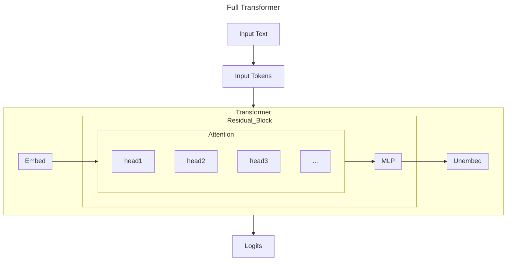

the tweet: lately i've been thinking bout the systems that will supposedly replace us? or back to basics. the ai within my b2b saas. required building: transformer from scratch
subtweet then link

the library is broken so this is updated guide

fix footer

--

I've wanted to dive deeper into the fundamentals of AI for a while now - it feels a little bit magical, and a little bit wrong, to operate alongside AI without a strong understanding of how the underlying mechanisms work. Naturally, I had to write a transformer, and Neel Nanda's "[GPT-2 From Scratch](https://www.youtube.com/watch?v=dsjUDacBw8o&list=PL7m7hLIqA0hoIUPhC26ASCVs_VrqcDpAz&index=2)" was my resource of choice. My adaptation (source notebook [here](https://github.com/emma-x1/ml-from-scratch/blob/main/transformers.ipynb) - I have Andrej Karpathy's micrograd tutorial in the same repo) follows his implementation, but adapted to use fewer dependencies, instead only using PyTorch and NumPy, with the GPT-2 model from HuggingFace to compare and verify. 

This post is meant to document my process of learning and to address some of the questions I was curious about when implementing the transformer for the first time. It includes an overview of transformer basics and some of my intuitions, followed by some of the points of interest (transformer secrets, if you will) and challenges I ran into. 

# Transformer Basics
## How a Transformer Works
A transformer is an I/O machine - a "sequence modelling engine." We take in a string of text, tokenize it, and output the next most likely token. Repeated over many iterations, this allows us to generate a body of text (or code, or images, or really any other sequence).

This transformer is really a series of linear algebra transformations in a high-dimensional vector space. Excuse the simplifications made in the following diagram:


- Each block above within `Transformer` represents a layer - a matrix linear transformation
- We implement `LayerNorm`, `Embed`, `PosEmbed`, `Attention`, `MLP`, and `Unembed` layers. `Attention` and `MLP` are joined into `Blocks`.
  - I go through each of these layers in a lot more depth in the notebook. There's also a lot of value in practicing by writing each one for yourself!
- Note the various heads of attention - each operation can be run in parallel, then all the outputs are re-joined and run through the MLP layer.
- Key terms:
  - Residual stream: a vector of size `[batch, n_ctx, d_model]`. Within each `Block`, the `Attention` and `MLP` layers read *from* the residual stream, calculates some delta, and write *to* the residual stream, updating it for the next iteration. Essentially, we are updating it in place `x = x + attention(x)` and `x = x + mlp(x)`.
  - Context window: the maximum length of tokens that the model can input/output. There's been a lot of discussion about increasing context length for better performance - essentially stuffing more information into each call to the transformer. Though it may feel like you can just keep adding to a stream of tokens indefinitely, there is a limit. This is a key limiting factor for, say,long-running agents and video generation.

- End to end, this looks like:
  - We take in a sequence of words as input: `<word> <word> <word> <word> <word>`
  - We tokenize them, mapping each word (or word segment) to a token in our dictionary `<token> <token> <token> <token>`
  - We embed the tokens - there's token embeddings (`Embed`) and positional embeddings (`PosEmbed`)
    - In `Embed`, we apply a matrix lookup table of shape `[d_vocab, d_model]` to tokens of shape `[batch, n_ctx]` to get a matrix of size `[batch, n_ctx, d_model]`.
      - Intuition: We're converting tokens into a matrix. We process `batch` sequences in parallel. Each row of our token input matrix is one of those sequences, and each entry is a token. Each token is replaced by its corresponding value in the `Embed` matrix, which is a tensor of size `d_model` - it is essentially a dictionary mapping integer token values to tensors.
    - We add `PosEmbed`, a lookup table of shape `[n_ctx, d_model]` to the same tokens of shape `[batch, n_ctx]`, getting another matrix of size `[batch, n_ctx, d_model]`.
      - Intuition: We need to add positional information to our tensor: the sentence fragment "who I am" is different than "who am I." We basically do the same thing as in embed, but map the token positions rather than the values themselves. This means it's the same across each sequence in the batch (they're all made up of <token1>, <token2>, ...) so each row is identical.
  - Next is the attention block, which consists of a `LayerNorm`, followed by `Attention`, then another `LayerNorm` and an `MLP` layer
    - In `LayerNorm`, we normalize the matrix, making sure values don't get too large or small. We have a vector of dimension `[d_model]` of ones (weights) and another of zeros (biases). These are tuned as the model trains. We normalize by substracting the average (making the mean 0) and scaling by variance (making the variance 1). Then, we multiply by the weight and subtract the bias to 'undo' normalization for specific dimensions.
      - Intuition: we normalize the entire matrix to return to a baseline range of values, then allow the trained model to undo some of the normalization to emphasize certain dimensions as needed.
    - Next is `Attention` (all you need!). There's actually many `heads` of atttention, each capturing different levels of dependencies between tokens. 
      - Intuition: query and key tell us where dependencies between tokens occur. Value tells how much we care about that dependency. We mix these to give us the attention pattern, project that onto 

In the actual GPT-2 model (as well as in our implementation), we use the following parameters:
```
    d_model: int = 768 # dimensionality of the residual stream
    d_vocab: int = 50257 # size of our dictionary
    d_head: int = 64 # dimension per attention head (d_model / n_heads)
    d_mlp: int = 3072 # size of the MLP layer (4 * d_model)
    n_ctx: int = 1024 # maximum number of tokens in a sequence    
    n_heads: int = 12 # number of attention heads
    n_layers: int = 12 # number of transformer blocks
```

## Training vs. Inference
There's a key distinction between model *training* and model *inference* - during training, we're using the text that we're giving it to have it update its internal weights to better predict the next token. During inference, we're no longer updating these weights, but rather using existing fixed weights to compute the next prediction on different input text.

# Some Additional Exploration
## Hardware Considerations
I'm running on an Apple M3.
mps cpu gpu

## Compares to Models Today

## Aside 1: Tokenizing
The process of tokenizing (converting raw input words to tokens) uses Byte-Pair Encoding (shoutout CS240E at Waterloo!), a process of encoding that uses a dynamic dictionary. We start with a dictionary having tokens for individual letters (ie. `a=1, b=2, c=3` - a bit of an oversimplication), and merging the most common groups of sequences to create a vocabulary of short strings (ie. the pair `a` + `b` occurs often, so we create in our dictionary `ab=4`), some of which are complete words and others are not. This forms our vocabulary of tokens, where each string corresponds to an integer.

I wonder if there's a different or more efficient way of tokenizing - maybe a more efficient algorithm or one that's independent of the English language? 

## Aside 2: Attention
this attention - self. others?
why output
- Why use `W_O` and `b_O` at all? I'd previously heard about the query-key matrices and the value matrix, but not the output. In the attention layer, we create an intermediate matrix `z` of shape `[batch, query_pos, n_heads, d_head]`. This is a mix of the attention scores (from `query` and `key`, indicating how much information each relationship holds), and values (from `value`, indicating ho)


## Transformer Secrets
A collection of miscellaneous rabbitholes I discovered - the more you know, the more you realize you don't know.
- [Initialization theory](https://stats.stackexchange.com/questions/637798/why-the-standard-deviation-of-the-bert-weight-initialization-is-0-02-by-default) - we have a mysterious parameter `init_range` set to 0.02 that normalizes our weights. In short, we need to keep our activations (values) within some healthy range to prevent either gradient explosion (if values are too big) or gradients vanishing (if values are too small). 0.02 is empirically tested but still a bit 'magical'.
- `einops` is a fascinating library - it makes the code declarative, not imperative so that we can describe by the results we want rather than how we want to do it. It's used to repeat certain values across the matrix - for instance, we can write `einops.repeat(pos_embed, "pos d_model -> batch pos d_model", batch=tokens.size(0))` to copy the positional embedding rows across the full matrix, rather than `pos_embed = pos_embed.unsqueeze(0).expand(tokens.size(0), -1, -1)`.
- `einsum` comes from "Einstein summation" 

# The Process
My version of the GPT-2 notebook is here, and it goes through the math and code in a lot more depth. https://github.com/emma-x1/ml-from-scratch/blob/main/transformers.ipynb. Once again, it follows Neel Nanda's excellent GPT-2 From Scratch with minor adaptations to reduce dependencies. 

TODO talk about process
can outsource thinking but not understanding
develooping intuition - why is this layer here? why this operation? why adding instead of dot producting? efficiency and 
there's still some mystery
and the more you know the more you realize you don't know

# Conclusion
there's sooooo much FUN stuff here. BPE??? attention??? like we can just play.

context, memory, etc

building IN the model and building AROUND the model

interpretability, science, etc is so rich.

next - a visual guide + toy example